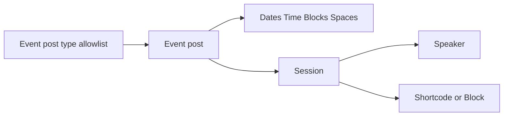

# ACF Event Schedule

Create sessions, speakers, and event schedules with Advanced Custom Fields.

[](https://github.com/joelmcdwebworks/ACF-Event-Schedule)
[](https://wordpress.org/)
[](https://www.php.net/)
[](https://www.advancedcustomfields.com/pro/)
[](LICENSE)

This is not a standalone events plugin. You attach a schedule to **existing public post types** (for example Pie Calendar events) chosen in settings. Those events get Dates, Time Blocks, and Spaces. The plugin then adds **Session** and **Speaker** post types and renders a time-by-space grid on the front end.



## Table of contents

- [Requirements](#requirements)
- [Installation](#installation)
- [Updates](#updates)
- [Setup](#setup)
- [Display](#display)
- [CSV import and export](#csv-import-and-export)
- [Customization](#customization)
- [Event taxonomy](#event-taxonomy)
- [Uninstall](#uninstall)
- [License](#license)

## Requirements

| Requirement | Version |
|-------------|---------|
| WordPress | 6.4 or later |
| PHP | 8.0 or later |
| [Advanced Custom Fields Pro](https://www.advancedcustomfields.com/pro/) | Required |

ACF Pro is a hard dependency. If it is not active, the plugin shows an admin notice and does not load.

## Installation

1. Install and activate **Advanced Custom Fields Pro**.
2. Clone or download this repository into `wp-content/plugins/ACF-Event-Schedule`.
3. Activate **ACF Event Schedule** from **Plugins**.

Activation registers the `session` and `speaker` post types and flushes rewrite rules.

## Updates

Sites that installed this plugin from GitHub receive updates on the WordPress **Plugins** screen when a new [GitHub Release](https://github.com/joelmcdwebworks/ACF-Event-Schedule/releases) is published. Pre-releases are ignored. GitHub’s auto-generated source zip is not used; a GitHub Action attaches `ACF-Event-Schedule.zip` with the plugin folder name WordPress expects.

To ship an update:

1. Bump `Version` in `acf-event-schedule.php` (and the `AES_VERSION` constant) so it is higher than the installed version.
2. Commit, then create a Git tag (for example `v1.1.15`) and publish a GitHub Release for that tag. Do not mark it as a pre-release.
3. Wait until the **Attach plugin zip** workflow finishes and `ACF-Event-Schedule.zip` appears on the release.
4. On a site running the previous version, open **Plugins** and use **Check for updates**. The update should install into the same `ACF-Event-Schedule` folder.

## Setup

### 1. Choose event post types

Go to **Settings → Event Schedule** and check which public post types should receive schedule fields. Session and Speaker are excluded from this list.

Typical choices are event-style post types such as Pie Calendar events, or any other public post type you use for events.

### 2. Build the event structure

Edit an event post and fill in the **Event Schedule** fields:

- **Dates** — one or more event days (`Y-m-d`).
- **Time Blocks** — nested under each date, with start time, end time, and an optional title. Titles are shown on the schedule for break rows that have no sessions (lunch, registration, and similar).
- **Spaces** — rooms or tracks, used as columns on the grid.

Time block and space IDs are generated automatically.

### 3. Add speakers

Create **Speaker** posts. Each speaker can have:

- First name and last name
- An optional event
- A sessions relationship (kept in sync with the matching session field)

### 4. Add sessions

Create **Session** posts. Each session requires:

- An event
- A time block from that event
- A space from that event, or **All** for a row that spans every space

Speakers are optional and bidirectional with the speaker relationship. If another session already uses the same event, time block, and space, WordPress shows a warning but still allows the save.

## Display

### Shortcode

Use `[event-schedule]` on an event post, or pass an event ID:

```
[event-schedule]
[event-schedule post_id="123"]
[event-schedule post_id="123" date="2026-09-19"]
```

| Attribute | Default | Description |
|-----------|---------|-------------|
| `post_id` | Current post | Event post ID |
| `date` | *(all days)* | Optional day filter (`Y-m-d`) |

### Block

Insert the **Event Schedule** block (`acf-event-schedule/schedule`) from the Widgets category. In the inspector, set **Event Post ID** (defaults to the current post) and an optional **Date**. The block supports wide and full alignment.

### What visitors see

The front end renders one section per day as a CSS grid of time versus space:

- Session cards link to the session, and list time, speakers, and space.
- A time block with a title and no sessions renders as a break row.
- Visitors only see the schedule for events they can read. Password-protected events require the password (editors can still preview).
- Session and speaker statuses follow the linked event. Draft events show their full grid to editors and in preview; publishing the event publishes those sessions and speakers.
- An empty schedule outputs a short “No schedule found” message.

The `session` and `speaker` post type slugs are unprefixed (`/session/`, `/speaker/`) and can collide with other plugins. You can change the rewrite slugs with the `aes_session_rewrite_slug` and `aes_speaker_rewrite_slug` filters. Do not rename the post type keys on an existing site.

## CSV import and export

**Settings → Event Schedule** includes import and export for an existing event.

Export a schedule, edit the CSV, and reimport it to the same event. Optional ID columns from the export update the matching time block, space, session, or speaker. Empty ID cells create new rows and posts, or reuse a match by time slot, space name, or title. Rows omitted from the CSV are left in place. An ID that is missing or belongs to a different event is rejected.

Limits: **2 MB** file size and **2000** data rows.

### Columns

| Column | Required | Description |
|--------|----------|-------------|
| `date` | Yes | Event date (`Y-m-d`, such as `2026-09-19`). Excel-style dates such as `10/16/26` are also accepted. |
| `start_time` | Yes | Time block start (24-hour `H:i` or 12-hour `g:i a`) |
| `end_time` | Yes | Time block end (same formats as `start_time`) |
| `time_block_title` | No | Shown on the schedule when the block has no sessions |
| `time_block_id` | No | Time block ID from export. Updates that time block when set |
| `space` | If the row has a session | Room or track name, or `All` for a full-width session |
| `space_id` | No | Space ID from export. Updates that space when set. Leave empty when `space` is `All` |
| `session_title` | No | Creates a session when set; leave empty for a break |
| `session_id` | No | Session post ID from export. Updates that session when set |
| `session_content` | No | Optional session post content |
| `speakers` | No | Speaker names separated by `;` |
| `speaker_ids` | No | Speaker post IDs from export, semicolon-separated in the same order as `speakers`. Updates those speakers when set |

Download the CSV template from the settings page, or start from this example:

```csv
date,start_time,end_time,time_block_title,time_block_id,space,space_id,session_title,session_id,session_content,speakers,speaker_ids
2026-09-19,09:00,10:00,Opening Keynote,,All,,Welcome Address,,Opening remarks for the event.,Alex Rivera,
2026-09-19,10:00,11:00,Morning Sessions,,Room A,,Building Better Schedules,,A practical session on planning rooms and time blocks.,Jordan Lee; Sam Patel,
2026-09-19,10:00,11:00,Morning Sessions,,Room B,,Community Lightning Talks,,,,
2026-09-19,11:00,12:00,Lunch,,,,,,,,
```

Export uses the same columns, with IDs filled in for existing rows and posts. A successful import reports what was created and how many existing sessions or speakers were saved.

## Customization

### Theme templates

Copy plugin templates into your theme to override markup:

```
your-theme/acf-event-schedule/schedule.php
your-theme/acf-event-schedule/session-cell.php
```

See [`templates/schedule.php`](templates/schedule.php) and [`templates/session-cell.php`](templates/session-cell.php). The grid root class is `.aes-schedule`.

### Filters

Change the assembled schedule payload:

```php
add_filter( 'aes_schedule_data', function ( $schedule, $event_id, $date ) {
    return $schedule;
}, 10, 3 );
```

Change the session query:

```php
add_filter( 'aes_schedule_query_args', function ( $args, $event_id ) {
    return $args;
}, 10, 2 );
```

### Programmatic render

```php
echo \ACF_Event_Schedule\Schedule_Renderer::render( $event_id, '2026-09-19' );
```

Pass an empty string as the date to render every day.

## Event taxonomy

Sessions and speakers are assigned a public `aes_linked_event` term that mirrors the Event field. Editors never pick this taxonomy: choosing an event on the session or speaker is enough. The term is a hook for theme PHP, Site Editor templates, and page-builder conditions.

- Classic PHP: `has_term( 'my-event-slug', 'aes_linked_event' )` in `single-session.php` or `single-speaker.php`, or taxonomy templates `taxonomy-aes_linked_event.php` / `taxonomy-aes_linked_event-{slug}.php`.
- Block themes: Site Editor templates for the Event taxonomy, including per-term variants.
- Page builders: singular or archive conditions for the Schedule Event taxonomy (Kadence: “Schedule Event Archives” under Sessions/Speakers, then the event term). Term names match the event title; slugs follow the event post slug. Draft and private events use an opaque term name (`Event {id}`) until the event is publicly viewable.

Speakers with no event have no term. The ACF Event field remains the source of truth for the schedule grid.

## Uninstall

Deleting the plugin from **Plugins** removes its settings (`aes_event_post_types`, schema, and rewrite flags). Session and speaker posts, ACF field data, and linked-event terms are left in place so an accidental uninstall does not wipe schedule content.

## License

[GPL-3.0-or-later](LICENSE). Built by [Joel McD Web Works](https://github.com/joelmcdwebworks).
